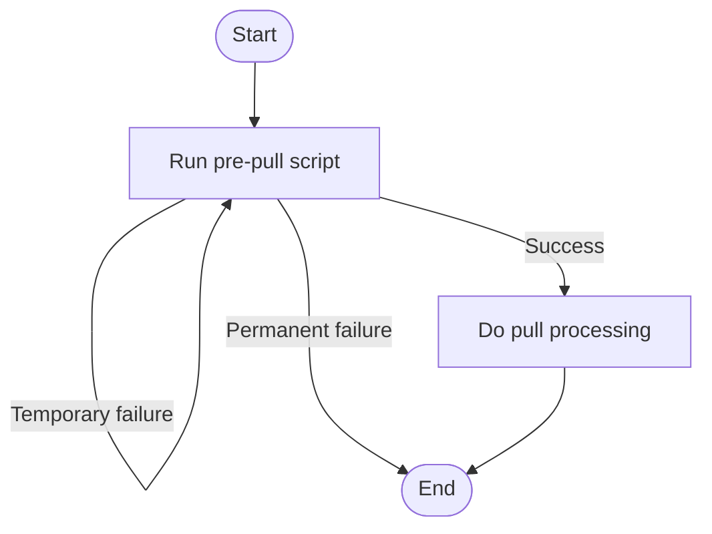
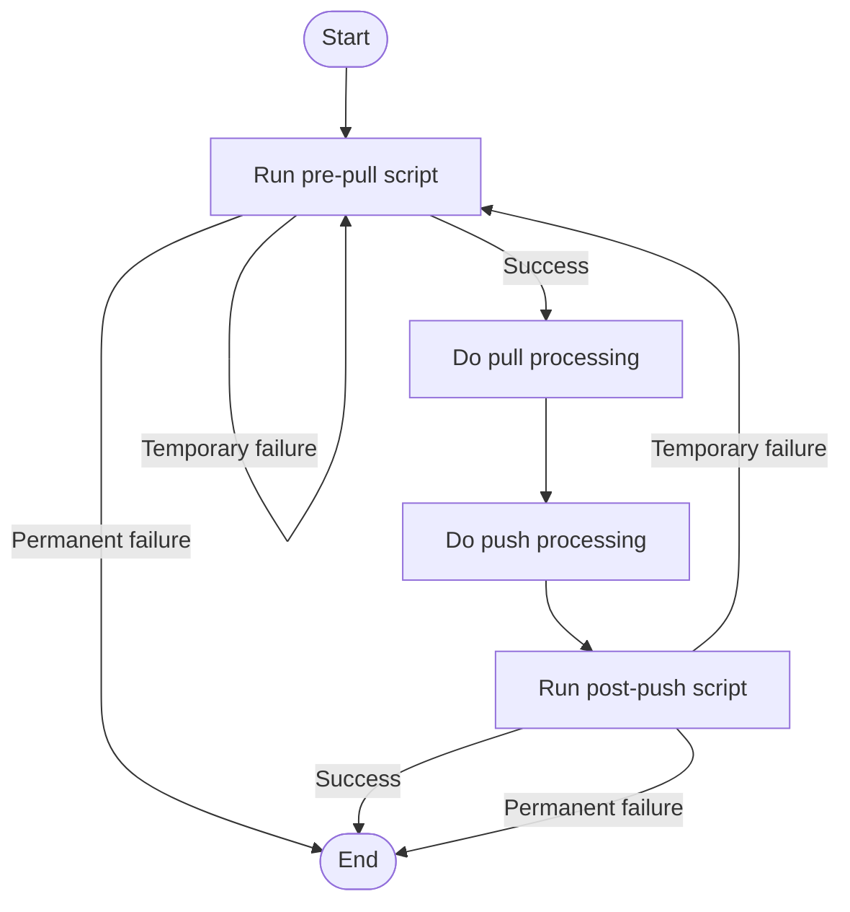

## JADX Collaboration

A plugin to enable users to collaborate on a JADX-GUI project.

## Installation

This plugin requires [JADX](https://github.com/skylot/jadx) 1.5.0 or greater.

In JADX-GUI:

- Navigate to `File > Preferences > Plugins`.
- Click `Install plugin`.
- Enter `github:interruptlabs:jadx-collaboration` as the `Location id`.
- Click `Install` and `Save`.
- If there is a project open, use `File > Reload files`.

## Setup

Start by creating a remote git repository that you and your collaborators will have access to. *If you already have a remote repository for JADX collaboration, this step can be skipped.*

Clone the remote repository to create a local version. If the repository has no commits, create one and push it (`git commit --allow-empty -m 'Initial commit' && git push`). *If you already have a local repository for JADX collaboration, this step can be skipped.*

Download a pair of `pull` and `push` scripts from [here](/scripts) (`.ps1` for Windows and `.sh` for Mac or Linux). If you are using Windows, you may need to run `Set-ExecutionPolicy Bypass` in an administrative terminal. If you are using Mac or Linux, ensure the scripts are executable (`chmod +x pull.sh push.sh`). *If you already have pre-pull and post-push scripts downloaded, this step can be skipped.*

Now, in JADX-GUI:

- Open the file you want to collaborate on.
- Save the JADX project (the location doesn't matter).
- Navigate to `File > Preferences > Plugins > JADX Collaboration`.
- In `Path to the repository file` enter the absolute path to a file in the root of your local repository (it does not have to exist). This file will be used to share changes between collaborators.
- In `Path to the pre-pull script` enter the absolute path to the `pull` script you downloaded earlier.
- In `Path to the post-push script` enter the absolute path to the `push` script you downloaded earlier.
- Click `Save` and use `File > Reload files` to apply the changes.

It is important that all collaborators:

- Work on the exact same Java file (distribution of Java files is not handled by the plugin).
- Set `Path to the repository file` to the same file (but in their own local repository).

## Usage

To pull changes from the remote repository, use `Plugins > Pull` or `CTRL + \`.

To push changes to the remote repository (will also pull), use `Plugins > Push` or `CTRL + SHIFT + \`.

## Advanced Setup

If you want to use a distribution mechanism other than git, then you will have to write your own pre-pull and post-push scripts. This guidance, along with the git scripts should hopefully enable you to do so.

### Purposes

The purpose of the pre-pull script is to copy the repository file from a remote location to a local location.

The purpose of the post-push script is to copy the repository file from a local location to the remote location.

The main challenge is dealing with conflicts, which will be covered later.

### Arguments

Both scripts will be given a single argument, the path to the repository file (in the local location).

### Exit Codes

The exit codes of your scripts are important:

- Zero represents success.
- One represents temporary failure.
- Any other number represents permanent failure.

This is the flow of the pull operation:

This is the flow of a push operation:

### Conflict

A conflict occurs when the destination repository file is newer than the source repository file:

- For the pre-pull script, this would mean that the repository file in the local location is newer than the repository file in the remote location. This should never occur, so the script should return a permanent failure error.
- For the post-push script, this would mean that the repository file in the remote location is newer than the repository file in the local location. This could occur under normal circumstances so the script should:
  - Restore the repository file in the local location to the state it was at the start of the operation.
  - Return a temporary failure error.

### General Notes

- Along with the repository file, this plugin also uses the repository file with a `.local` suffix. This file should be ignored by your scripts and not copied to the remote location.

# Building

Building requires a full `jadx.jar` in the root of the project.

Use `./gradlew dist` or `./gradlew.bat dist` to build.
